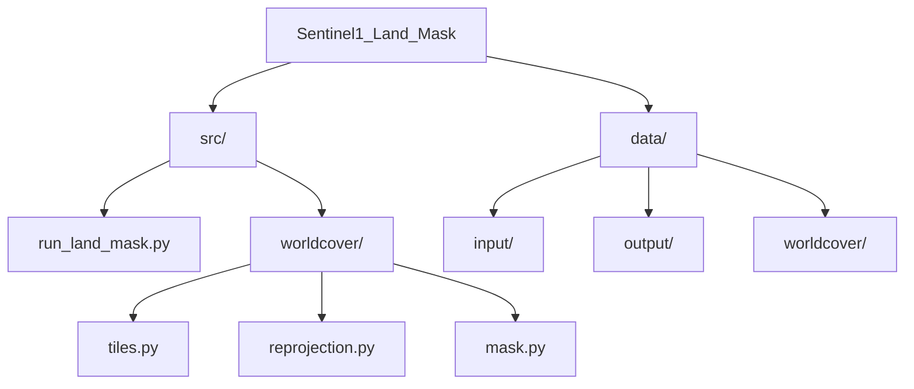

# Sentinel-1 Land Masking with ESA WorldCover

This project provides a Python-based workflow to generate accurate land masks for
Sentinel-1 SAR imagery using ESA WorldCover as a static land prior, with correct
handling of SAR geometry and geocoding.

## Repository Structure



## Features
- Works with geocoded Sentinel-1 GRD / RTC imagery
- Automatic selection of required ESA WorldCover tiles
- Correct reprojection and nodata handling
- Preserves true Sentinel-1 acquisition geometry
- Suitable for Arctic and coastal environments

## Requirements
- Python 3.8+
- rasterio
- numpy
- scipy

## Data (not included)
This repository does not include:
- Sentinel-1 imagery
- ESA WorldCover tiles

These must be downloaded separately.
ESA WorldCover tiles can be downloaded from the official portal:
https://worldcover2021.esa.int/downloader

Store the tiles under `data/worldcover/ESA_Worldcover` so the script can find
them by filename (e.g., `ESA_WorldCover_10m_2021_V200_N54W060_Map.tif`). If you
keep them elsewhere, update the `WORLDCOVER_DIR` path in `src/run_land_mask.py`.

## Usage
```bash
python src/run_land_mask.py
```

## Outputs
- `data/output/hh_masked_<bounds>.tif`: HH channel with land set to NaN
- `data/output/hv_masked_<bounds>.tif`: HV channel with land set to NaN

The `<bounds>` tag is derived from the input scene bounds in WGS84 and keeps
the outputs geocoded to the original Sentinel-1 grid.
